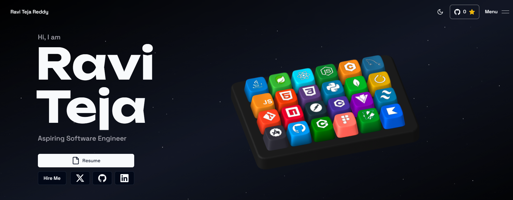

<p align="center">
  
</p>

<h1 align="center">🌌 3D Interactive Developer Portfolio</h1>

<p align="center">
  A highly interactive, visually immersive, and performance-focused 3D portfolio built to showcase my software development skills, experience, and projects.
</p>

<p align="center">
  <strong>Explore the Live Experience:</strong>
  <a href="https://portfolio-raviteja2.vercel.app">
    portfolio-raviteja2.vercel.app
  </a>
</p>

<p align="center">
  
  
  
  
  
</p>

<p align="center">
  
  
  
  
  
  
</p>

---

# 📂 Repository Structure

```text
3d-portfolio/
│
├── public/                 # Static assets, resume & project screenshots
│   └── assets/             # Images, icons & 3D Spline assets
│
├── src/
│   ├── app/                # Next.js App Router, pages & API routes
│   ├── components/         # Reusable UI & portfolio components
│   ├── content/            # Portfolio content
│   ├── data/               # Skills, projects & configuration data
│   └── hooks/              # Custom React hooks
│
├── package.json            # Project dependencies & scripts
└── README.md               # Project documentation
```

---

# 🏗 System Architecture

```text
                 ┌──────────────────────┐
                 │      Next.js App     │
                 │    React + TypeScript│
                 └──────────┬───────────┘
                            │
          ┌─────────────────┼─────────────────┐
          │                 │                 │
          ▼                 ▼                 ▼
    Portfolio UI       3D Experience     Animations
   Tailwind CSS           Spline        GSAP / Framer
          │                 │                 │
          └─────────────────┼─────────────────┘
                            ▼
                    Next.js API Routes
                            │
                            ▼
                       Resend API
                            │
                            ▼
                       Contact Email
```

---

# ✨ Key Highlights

- 🎹 Interactive 3D skills keyboard powered by Spline
- 🎮 Immersive 3D portfolio experience
- ⚡ Smooth animations with GSAP and Framer Motion
- 💼 Dedicated experience and skills sections
- 🚀 Interactive project showcase with screenshots
- 🔍 Expandable project image previews
- 📄 Integrated resume viewing and access
- 📧 Serverless contact form powered by Resend
- 🌗 Light and dark theme support
- 📱 Fully responsive design across devices
- ☁️ Continuous deployment with Vercel and GitHub

---

# 🛠 Technology Stack

| Category | Technologies |
|----------|--------------|
| Framework | Next.js |
| Frontend | React, TypeScript |
| Styling | Tailwind CSS, Radix UI |
| 3D Experience | Spline |
| Animations | GSAP, Framer Motion |
| Email | Resend API |
| Version Control | Git, GitHub |
| Deployment | Vercel |

---
